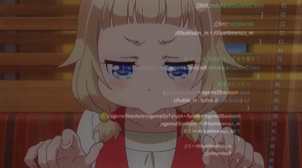

<h1 align="center">☕ ⟩ JavaProgramas ⟨ ☕</h1>

 Programas em Java escritos com base nos Nano Courses da FIAP.
 Java é uma língua bem única, com sintaxe "similar" a C, mas ainda assim, é meio que um saco. Tudo é meio alongado demais, mas ainda assim é uma das línguas mais usadas na indústria, então estou aprendendo!
 
Em outras palavras, este é Apenas mais um repositório de programas para meu aprendizado! Então, não leve muito a sério, nem nada.

